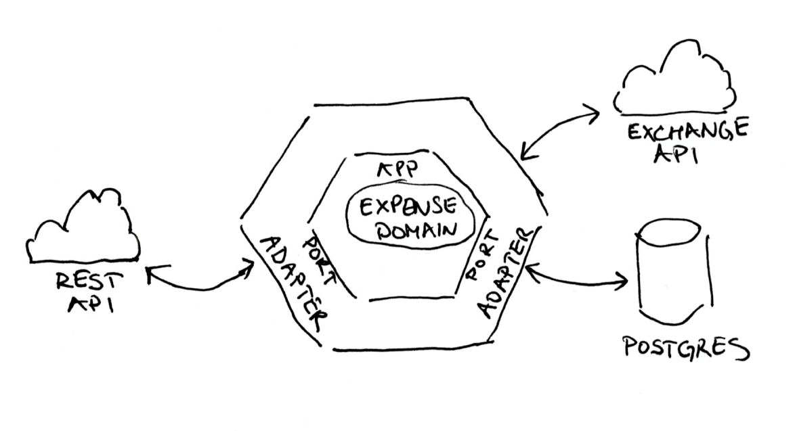

# Engage Expense Service

The service for keeping data about customers' expenses.

## Architecture Overview

The intention of this architecture was to create loosely coupled module components that could be easily adjusted / replaced with a new ones.

### Hexagonal Architecture

Domain i.e. logic of the app is separated from its external dependencies by the means of ports and adapters. The idea here is to isolate the domain logic from the outside concerns. The biggest benefit is that we could easily swap each component if necessary. The ports serve as the contract for the primary (incoming) and secondary (outbound) adapters.

  

<i>Architecture Overview</i>

The following adapters exist in the system:

 - **rest-api** - primary adapter used to create and query data in the expense domain.
 - **exchange-api** - secondary adapter used to query public API to fetch the exchange rates of a given currency. Implemented as a _circuit breaker_ with a fallback to the alternate exchange rate API. All response from the public API are cached in memory to reduce number of external API calls.
 - **postgres** - secondary adapter used to store expense domain data.

### Domain

The central point of a domain is the customers' expense.

## Getting Started

These instructions will explain how to get a copy of the project up and running on your local machine for development and testing purposes.

### Prerequisites

In order to build the project you will have to have [Java 15+](http://www.oracle.com/technetwork/java/javase/downloads/index.html), [Docker](https://docs.docker.com/install/)
and [Docker Compose](https://docs.docker.com/compose/install/) installed on your machine.

You might already have some software already installed on you machine. To confirm it, please run the following commands
in your terminal window:

For Java:

    java --version

For Docker:

    docker --version

For Docker Compose:

    docker-compose --version 

### Installing and Running

Follow the steps below to quickly bring up the infrastructure.

> It is assumed that you've opened your terminal window and navigated to the directory of this document.

#### Start Postgres and Expense Application

To start all the services run the following command from your terminal window:

    ./run.sh

This script will execute tests and package the expense-app, build the Docker image for the expense-app and Postgres and install them
in your local Docker image registry. All containers will then be run using **docker-compose**.

> **Important:**
>Make sure that you have the following ports available in your local machine: **8080** and **5432**. These are
>the ports used by **expense-app** and **Postgres**, respectively.

After you have run the `./run.sh` for the first time, all services will be containerized. Therefore, for every subsequent infrastructure bootstrap, it is sufficient to run **docker-compose**:

    docker-compose up

## Running the Tests

    ./gradlew clean test

## API Reference

REST API consists of customer and data object resources:

1. Expense

   In order to create new expense call:

        POST /expenses

   In order to fetch all expenses call:

        GET /expenses

2. Authentication

   To login to the expense-app:

        POST /login

### Example API Calls

Example API calls expense and authentication resource:

* To create a new expense:

  Request:

        curl -X POST 'http://localhost:8080/expenses' \
        -H 'Content-Type: application/json' \
        -H 'Authorization: Bearer {access_token}' \
        -d '{
            "date": "25/02/2020",
            "expense": "499.00 EUR",
            "reason": "Some reason"
        }'

  Response:

        Header:
            Status: 201 Created
            Location: /expenses/{id}
        Body:

* To get all expenses:

  Request:

        curl -X GET 'http://localhost:8080/expenses' \
        -H 'Authorization: Bearer {access_token}'

  Response:

        Header:
            Status: 200 OK
        Body:
            [
                {
                    "id": 1,
                    "amount": "1000.00",
                    "vat": "200.00",
                    "date": [
                        2020,
                        1,
                        1
                    ],
                    "reason": "Some reason1"
                },
                {
                    "id": 2,
                    "amount": "599.00",
                    "vat": "119.80",
                    "date": [
                        2020,
                        3,
                        17
                    ],
                    "reason": "Some reason2"
                }
             ]

* To authenticate at expense service:

  Request:

        curl -X POST 'http://localhost:8080/login' \
        -H 'Content-Type: application/json' \
        -d '{
            "username": "tom",
            "password": "jones"
        }'

  Response:

        Header:
            Status: 200 OK
        Body:
            {
                "accessToken": "{access_token}",
                "tokenType": "Bearer"
            }

## Built With

* [Spring Boot](https://projects.spring.io/spring-boot/) - The application framework
* [Gradle](https://gradle.org) - Build tool
* [Docker](https://docs.docker.com/install/) - Container packaging

