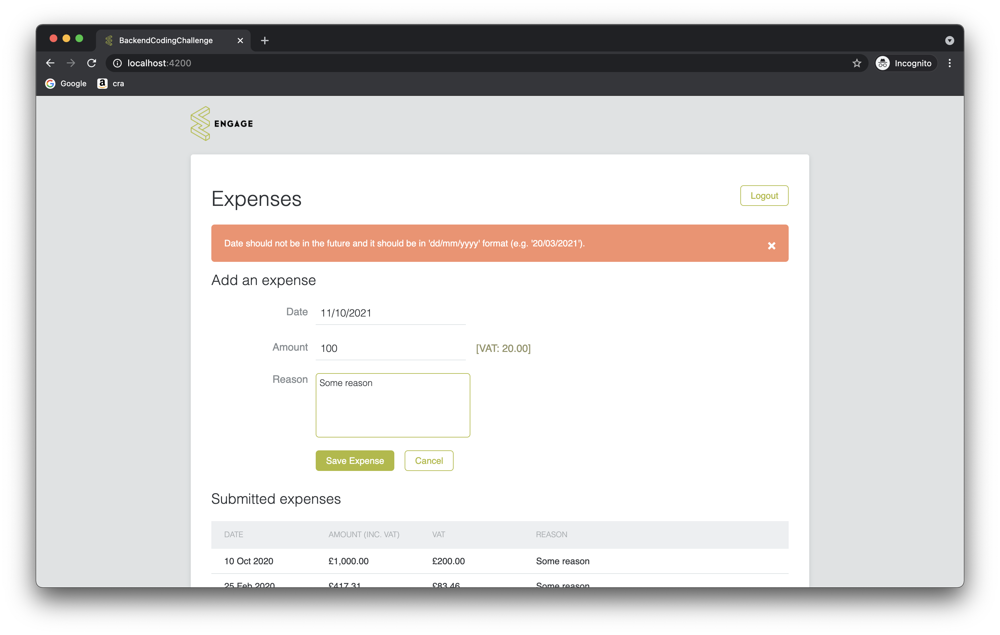

# Engage Expense Service

The service for keeping data about customers' expenses.

## Architecture Overview

The intention of this architecture was to create loosely coupled module components that could be easily adjusted / replaced with a new ones.

### Hexagonal Architecture

Domain logic of the app is separated from its external dependencies by the means of ports and adapters. The idea behind it is to isolate the domain logic from the outside concerns. The biggest benefit is that we could easily swap each component if necessary. The ports serve as the contract for the primary (inbound) and secondary (outbound) adapters:

  

<i>Architecture Overview</i>

The following adapters exist in the system:

 - **rest-api** - primary adapter - used for creation and for querying of the data in the expense domain.
 - **exchange-api** - secondary adapter - used for querying public exchange rate API to fetch the rates for designated currency. It is implemented as a _circuit breaker_ with a fallback to the alternate exchange rate API. All responses from the public API are cached in memory to reduce the number of external API calls.
 - **postgres** - secondary adapter - used for storage of the expense domain data.

### Domain

The central point of a domain is the customers' expense.

## Getting Started

These instructions will explain how to get a copy of the project up and running on your local machine for development and testing purposes.

### Prerequisites

In order to build the project you will have to have [Java 15+](http://www.oracle.com/technetwork/java/javase/downloads/index.html), [Docker](https://docs.docker.com/install/)
and [Docker Compose](https://docs.docker.com/compose/install/) installed on your machine.

You might already have some software already installed on you machine. To confirm it, please run the following commands
in your terminal window:

For Java:

    java --version

For Docker:

    docker --version

For Docker Compose:

    docker-compose --version 

### Installing and Running

Follow the steps below to quickly bring up the infrastructure.

> It is assumed that you've opened your terminal window and navigated to the directory of this document.

#### Start Postgres and Expense Service Application

To start all the services run the following command from your terminal window:

    ./run.sh

This script will execute tests and package the **expense-service**, build the Docker image for the **expense-service** and Postgres and install them
in your local Docker image registry. All containers will then be run using **docker-compose**.

> **Important:**
>Make sure that you have the following ports available on your local machine: **8080** and **5432**. These are
>the ports used by **expense-service** and **Postgres**, respectively.

After you have run the `./run.sh` for the first time, all services will be containerized. Therefore, for every subsequent infrastructure bootstrap, it is sufficient to run **docker-compose**:

    docker-compose up

## Running the Tests

    ./gradlew clean test

## API Reference

REST API consists of authentication and expense resources:

1. Authentication

   To login to the expense-service:

        POST /login
        
2. Expense

   In order to create a new expense:

        POST /expenses

   In order to fetch all expenses:

        GET /expenses

### Example API Requests

Example API requests for the authentication and expense resource:

* To authenticate with expense-service:

  Request:

        curl -X POST 'http://localhost:8080/login' \
        -H 'Content-Type: application/json' \
        -d '{
            "username": "tom",
            "password": "jones"
        }'

  Response:

        Header:
            Status: 200 OK
        Body:
            {
                "accessToken": "{access_token}",
                "tokenType": "Bearer"
            }

* To create a new expense:

  Request:

        curl -X POST 'http://localhost:8080/expenses' \
        -H 'Content-Type: application/json' \
        -H 'Authorization: Bearer {access_token}' \
        -d '{
            "date": "25/02/2020",
            "amount": "499.00 EUR",
            "reason": "Some reason"
        }'

  Response:

        Header:
            Status: 201 Created
            Location: /expenses/{id}
        Body:

* To get all expenses:

  Request:

        curl -X GET 'http://localhost:8080/expenses' \
        -H 'Authorization: Bearer {access_token}'

  Response:

        Header:
            Status: 200 OK
        Body:
            [
                {
                    "id": 1,
                    "amount": "1000.00",
                    "vat": "200.00",
                    "date": [
                        2020,
                        1,
                        1
                    ],
                    "reason": "Some reason1"
                },
                {
                    "id": 2,
                    "amount": "599.00",
                    "vat": "119.80",
                    "date": [
                        2020,
                        3,
                        17
                    ],
                    "reason": "Some reason2"
                }
             ]

## Starting the UI Dashboard Application

### Prerequisites

To run the UI dashboard app locally, you need to have installed on your computer [Node.js](https://nodejs.org/en/) and [Angular CLI](https://cli.angular.io/).

> **Important:**
>Make sure that the port **4200** is available on your local machine. This port is used for serving the UI Dashboard.

### Installing and Running

Open up a new terminal window and position yourself to the repository's root directory and then install and start the application:

    cd ..
    
    npm install && ng serve
    
### Using the UI Dashboard

Once the UI Dashboar application is up and running go to http://localhost:4200 in your browser. Login with the following credentails (username/password): __tom/jones__ to access the expense dashboard. After successful login you will be redirected to the expenses page:

  

<i>Expenses Dashboard</i>

## Built With

* [Spring Boot](https://projects.spring.io/spring-boot/) - The application framework
* [Gradle](https://gradle.org) - Build tool
* [Docker](https://docs.docker.com/install/) - Container packaging

